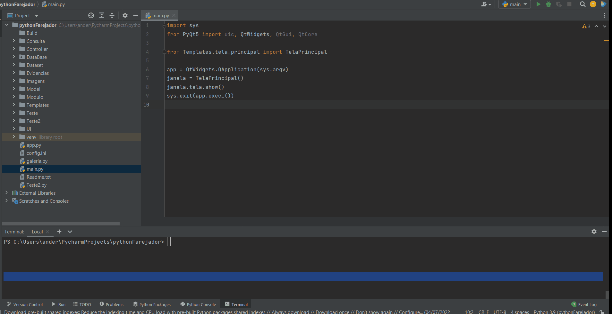

[](https://www.linkedin.com/in/anderson-santana-53a51a69) [](http://perso.crans.org/besson/LICENSE.html)

<p align="center">
  
</p>

# Ferramenta de busca de imagem de pornografia infanto-juvenil


O FAREJADOR é um software de código aberto portável que pode ser usado para buscar imagem de pornografia infanto-juvenil em grandes volumes.

## Introdução:

Nos úlimos anos, tem-se verificado um elevado aumento de denúncias dos crimes de ciberpedofilia. Como consequência deste crescimento, o número de operações de busca e apreensão cresceram também, e com isso, o perito de informática se depara com situações que precisam analisar no local imagens que comprovem a materalidade da prisão em flagrante do indivíduo.

Esse software foi um trabalho de conclusão do curso da Pôs-Graduação em Computação Forense e Perícia Digital (instituição IPOG). Um software focado em desempenho e na eficiência na busca de imagem usando tecnologias modernas.

<p align="center">
  
</p>

**Tecnologias utilizadas:** Python, Hash, OpenCV, VP-Tree, SQLite.

**Características:**
* Suporte multiplataforma, testado em sistemas Windows e Linux
* Não precisa de instalação podendo ser executado em unidade removíveis
* Alto desempenho na indexação e na busca das imagens
* Relatório com as evidências encontradas com seus metadados
* Gera o hash das imagens encontradas para garantir a cadeia de custódia. 

## Demo:




## Setup:
Configuração do ambiente de desenvolvimento.

**Ferramenta de Desenvolvimento:**

Recomendamos o PyCharm versão gratuito o Community (https://www.jetbrains.com/pt-br/pycharm/download/#section=windows).

<b>Instalação do Python no Windows:</b>

Para instalar o Python no Windows acesse o site oficial (https://www.python.org/downloads/), baixe a versão 3.9.4 ou posterior. Nesse mesmo site possui a documentação de instalação para cada sistema operacional.

<b>Instalação do Python no Linux:</b>

Atualize o gerenciador de pacotes com o comando:
```sh
sudo apt-get update
```
Para o Python 3.9, use este comando:
```sh
sudo apt-get install python3.9
```

<b>Instalação das Bibliotecas no Python:</b>
```sh
pip install numpy
```
```sh
pip install opencv-contrib-python
```
```sh
pip install imutils
```
```sh
pip install vptree
```
```sh
pip install pyqt5 pyqt5-tool
```


## Referências:

* BARELI, Felipe da Costa. Introdução à Visão Computacional. São Paulo: Casa do Código, 2019.
* MENEZES, Nilo Ney Coutinho. Introdução à Programação com Python . São Paulo: Novatec, 2017.
* ELEUTÉRIO, Pedro Monteiro da Silva; MACHADO, Marcio Pereira. Desvendando a Computação Forense . São Paulo: Novatec, 2011.
* ELEUTÉRIO. Nudetective. [S.l.], 2022a. Disponível em: http://www.eleuterio.com/nudetective.html.
* TINEYE. Reverse Image Search. 2022a. Disponível em: https://tineye.com.
* TINEYE. Reverse Image Search FAQ. 2022b. Disponível em: https://tineye.com/faq.
* MICROSOFT. PhotoDNA Cloud Service. 2022b. Disponível em: https://www.microsoft.com/en-us/photodna.
* MICROSOFT. PhotoDNA Cloud Service FAQ. 2022b. Disponível em: https://www.microsoft.com/en-us/PhotoDNA/FAQ.
* OPENCV. OpenCV Open Source Computer Vision Library. 2022a. Disponível em: https://github.com/opencv/opencv.
* WIKIPÉDIA. Distância de Hamming. 2022a. Disponível em: https://pt.wikipedia.org/wiki/Dist%C3%A2ncia_de_Hamming.
* STEVE. VP trees: A data structure for finding stuff fast. 2022a. Disponível em: http://stevehanov.ca/blog/?id=130>.
* Nielsen. Bregman proximity queries. 2022a. Disponível em: https://www.lix.polytechnique.fr/~nielsen/BregmanProximity/>.
* Fribbels. VP-Tree. 2022a. Disponível em: https://fribbels.github.io/vptree/writeup.
* Pymagesearch. Image Search VP-Tree and OpenCV. 2022a. Disponível em: https://pyimagesearch.com/2019/08/26/building-an-image-hashing-search-engine-with-vp-trees-and-opencv.
* PyQT. QT for Python Docmentation. 2022a. Disponível em: https://doc.qt.io/qtforpython.


